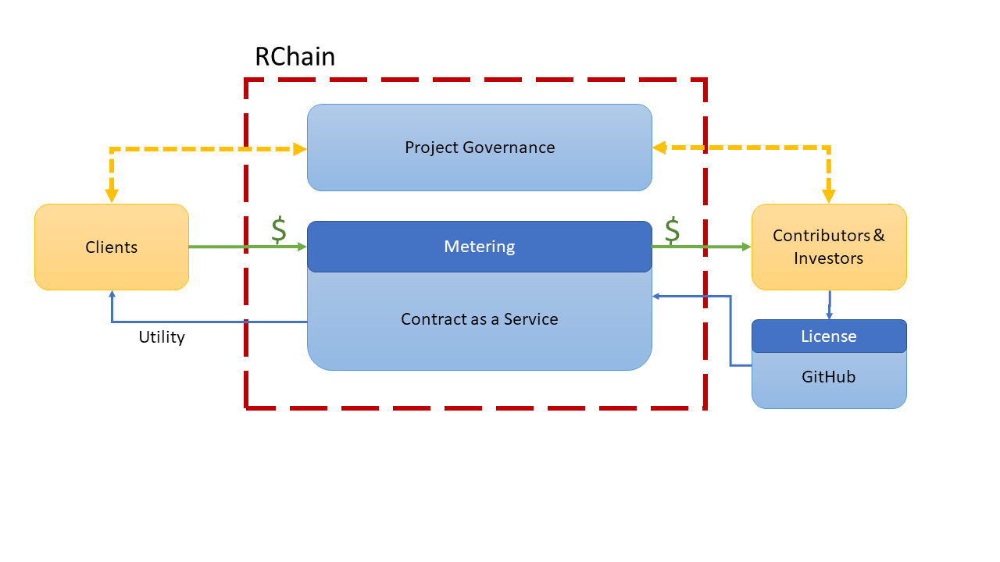

# Compensated Open Source License
A license for compensatated work through revenue sharing using smart contracts.

Projects which use the Compensated OSS license:
* Identify a stream of revenue;
* Accept a liability along with contributive effort to be paid from the revenue stream;
* May accept investment in the form of loans with both principal and interest to be paid from the revenue stream;
* Relinquish any copyrights for work which has been compensated;
* Openly share any source materials for public collaboration and encourage derivative projects which accept the terms of the license; and
* Specify a form of governance to be used when making decisions concerning stakeholders of the project which clearly defines their rights and obligations.

_**NOTE**: This license is a work in progress and has **NOT** been reviewed by **ANY** legal professionals. Do **NOT** use this license other than under your own risk and for the purposes of experimentation._

# How the License Works
The Compensated OSS license is part of a larger vision for a revenue sharing business model intended for use on consensus-based compute platforms such as RChain or Ethereum. While it isn't absolutely necessary to use a smart contracting system with the capability of sending and receiving value through code, it is a helpful framework to understand how the model works.

## The Revenue Stream
The license is intended for projects that require some form of payment for use of its products or services. As revenue is brought into the project it is distributed to those who hold liabilities against the project, for example, people who have provided work, or funding through loans, or other expenses. 
    
## Accept Work along with a Compensation Agreement
When collaborators do work which is accepted by the project (e.g. when accepting a pull request), then the project also accepts a change to its rules, potentially coded in a smart contract, for how revenue is distributed. In the simplest case, a project might include a single liability: an agreement to pay the project author X amount. All revenue would be transferred to the project author until the amount is payed, at which point the project would become free to use. Of course, real projects are made from many contributions so the policies for how the revenue contracts may be modified are covered under the project's governance.

The project's policies for accepting a compensation agreement must hold each contributer accountable for both the positive and negative outcomes of our actions. When contributors to a project produce something of value, the project must accept a liability, an agreement to share in the proceeds of the organization. For projects with an established revenue stream, this payment could be immediate, or settled in a short time with near term revenue. For startup projects, the liability might remain for years and perhaps never be met because of a lack of revenue. For long term liabilities, the project should agree to the value of the work and also to terms for payment, including interest to be paid from potential future revenue. This contract may be transferable, allowing a worker to sell their work to someone else.

An individual who collaborates with a project must also accept a portion of the risk of any potential liabilities of the project. Options for individual collaborators include but are not limited to forming an LLC and purchasing private insurance or, working with a project's governance to purchase liability insurance for all contributors.

## Accepting Loans
Parties can participate in the project by bringing capital in the form of a loan. The process for accepting a loan is similar to accepting a compensation agreement in that the revenue smart contracts are modified to include the payment terms of the loan. The proceeds of the loan are disbursed based on the project's governance policies. This might include payment of compensation, payment of expenses, purchasing of equipment, etc.

## Relinquishing Copyrights for Compensated Work
For work which has not yet been compensated, any project which would create a derived work (e.g. a fork) must agree to terms of collecting revenue and sharing that revenue with the source project until its liabilities (up to the point of the fork) are paid, by a combination of revenue from the source project and the derived project. Once liabilities are paid, the project is made available similar to any other open source project and is free to be used. It is acceptable for a project to include changes to the revenue contracts when receiving revenue from customers (e.g. a 50% split between paying off the projects liabilities and accepting a new liability on behalf of the customer). This provides a way for early customers to share the cost of development with customers who come later.

## Sharing Source Materials
The goal of the license is to create a means for openly collaborative yet compensated work. The barriers for entry to collaborate on the project should be kept as low as possible with a goal of meeting the same ease of collaboration as is found with open source projects today. People who would like to take the project in a different direction should be free to, but they must work to come to a good faith agreement to generate revenue from their work to compensate any previous work they are building from.

## Project Governance
The project must clearly state the rights of all stakeholders and the process which project-related decisions are made. No specific forms of governance are required, but it is expected that effective forms of governance will emerge from the use of smart-contract-defined processes. At a minimum, the project must state policies and procedures for these events:
* The process for accepting work
* The process of pricing / accepting revenue and how it will be disbursed
* The policy and process for accepting loans (or not) and how the proceeds of the loan are disbursed
* The policy and process for negotiating revenue sharing agreements with derivative projects
* A statement of liability and potential risks associated with participating with the project
* A statement of applicable jurisdiction and other statements to meet any legal obligations

_**NOTE**: This license is a work in progress and has **NOT** been reviewed by **ANY** legal professionals. Do **NOT** use this license other than under your own risk and for the purposes of experimentation._

# Cooperative Decentralized Organizations
Before mass and digital communications, it was natural to consider an organization as residing at a physical place like a farm, a shop, or a factory. People gathered there to work together to make a product or service to be offered at the market. Because of the organization's physical presence, the social conventions of physical property ownership were projected onto the organization. Those who owned the property rights to the land that was farmed, or the plot where the shop or factory sat, it was assumed, should not only command the operation of the work but should also determine how the proceeds be divided. We see this today in the nearly universal practice of owners setting a fixed price for labor in terms of an annual salary or hourly wage, with the remainder of the revenue, minus non-labor expenses, taken as profit.

Today, organizations exist which are mostly virtual, not tied to any physical location, and operate globally. What binds them together is a shared governance, an agreement to work together to produce something of value and to share the proceeds. An increasing number of these organizations are constructed primarily out of software, and these software defined, virtual companies provide an increasing number of services which are replacing their physically rooted counterparts. There are, for example, online marketplaces for short-term lodging which compete effectively with traditional hotels, or marketplaces for on-demand transportation replacing city taxi services.

As the value in organizations is captured within the combination of software code and the network of people who use it, it's natural to question if the projection of physical property rights is still a fitting metaphor. It becomes even more questionable when considering the new, decentralized compute platforms which are emerging. Consensus based compute platforms like Ethereum and RChain, running on a globally distributed network of compute nodes, provide a secure, public compute utility where not only is the computer hardware not owned, leased, or rented as they would be under traditional organizational structures but the code, component by component, can earn its own keep, if you will, by charging for its own execution.

These consensus-based compute platforms, due to the very high level of trust they establish, have changed the language that software developers use to describe their work, from the term "program" to "contract". These systems are in their very early stages of adoption but are already transacting $$ of value in simple value trade contracts. Innovative platforms using more expressive contracting languages, such as Rholang on the RChain platform, will enable the creation of organizations defined with an increasingly sophisticated, interdependent collection of computable contractual agreements. The scope of these contracts will quickly expand beyond simple financial transactions to include formally coded procedures for human processes like adding new workers, compensation, planning, etc. If you change the code, you'll change the organization. 

